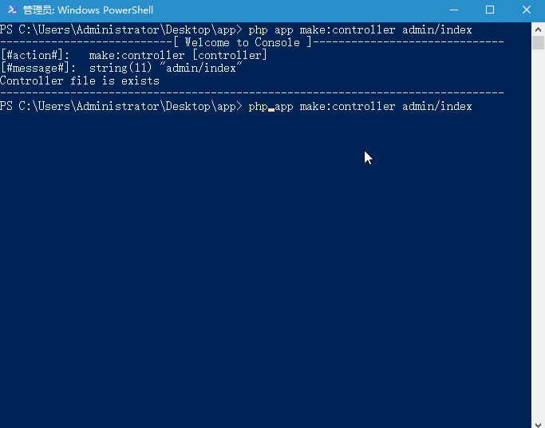

# tp5-console

*请把文件放到 thinkphp的根目录，命令行切换到thinkphp目录执行

*这是一款thinkphp5的代码生成辅助工具

## 只支持thinkphp5

## 简单使用
 
		Init       : php app init admin ;
		All        : php app make admin/index;
		Controller : php app make:controller admin/index;
		Model      : php app make:model      admin/index;			
		View       : php app make:view       admin/index/info;
		Validate   : php app make:validate   admin/index;
		Service    : php app make:service    admin/index;

# 配置

	Console/Config.php
	可以进行配置，'APP_PATH'表示项目目录名称

	Console/tpl
	模板都可以自己定义

# 帮助

	php app -h

# 版本

	php app -v

